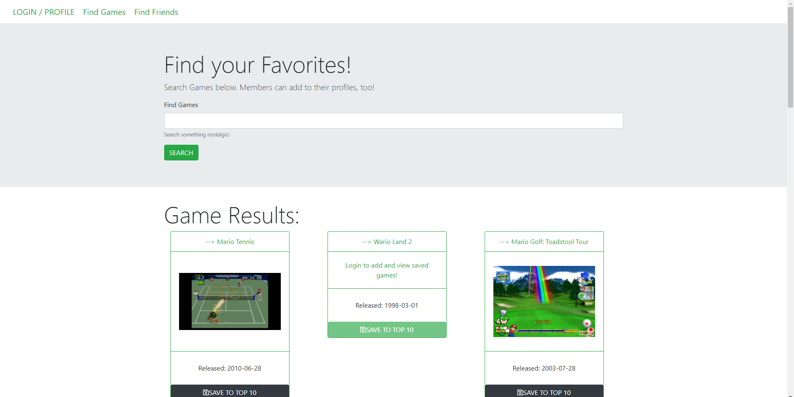

# A Bluetooth-Coffee-Cup collaboration ☕


# GAME KIWI.🥝 ___Its a kiwi kiki !___

## Description

This application allows the client to browse a huge selection of Video-Games, both New and Nostalgic!

Following sign-up, a member has the ability to Add up to 10 games to their profile/playlist, to share and compare with other KIWI users.

The goal for this application is to create a community based around shared interests of certain video-games.

## Installation

Clone repo, Here. [GAME KIWI Repo](https://github.com/Gerardo-S/bluetooth-coffee-cup)

Open via Code Editor. 

## Usage

### Env Vars
This app uses dotenv. Requires a `.env` file like the following:

```
SERVER_SECRET = your_server_secret
```

### Dependencies
Install npm dependencies.  ```  
  "dependencies": {
    "bcryptjs": "2.4.3",
    "dotenv": "^8.2.0",
    "express": "^4.17.0",
    "express-handlebars": "^5.1.0",
    "express-session": "^1.16.1",
    "mysql2": "^1.6.5",
    "passport": "^0.4.0",
    "passport-local": "^1.0.0",
    "sequelize": "^5.8.6"
  },
  "devDependencies": {
    "chai": "^4.1.2",
    "chai-http": "^4.0.0",
    "cross-env": "^5.2.0",
    "eslint": "^4.19.1",
    "eslint-config-prettier": "^2.9.0",
    "eslint-plugin-prettier": "^2.6.2",
    "mocha": "^5.2.0",
    "prettier": "^1.13.7"``` 
    
Run ```npm i ``` in terminal.

### Deployed info.

Deployed VIA [HEROKU.](https://infinite-plains-30611.herokuapp.com/)

MySQL DATABASE Host via JAWsDB. 

API provided by: [RAWg IO.](https://rawg.io/)


## Screens

Landing Page:


Search Games Page:




## Questions

[Gerardo Solis : Github](https://github.com/Gerardo-S)

[Shawn Yandall : Github](https://github.com/dohmr/)

[Christopher Cruzcosa : Github](https://github.com/christopher-cruzcosa)
